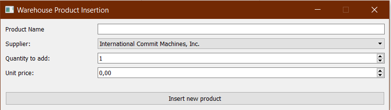

# PyWarehouse

A simple warehouse management tool written in Python.
The backend database is based on Oracle DB.
Can export the database data to PDF.

Dependencies:
- **pdfkit** (need to supply _wkhtmltopdf32.exe_ in the tools folder)
- **cx_Oracle**
- **PyQt5**

The database schema can be found in the _db_ folder.
The UI files (drawn in Qt Creator) can be found in the _ui_ folder.

Start it with the command:

    python main.py

Tested on Windows 10 with Python 3.9 (conda virtual env.) and Oracle Database 21c Express.

Missing functionalities:
- Insert new suppliers
- Delete/Modify quantity of products

## Some screenshots:

### A sample report open in SumatraPDF:

